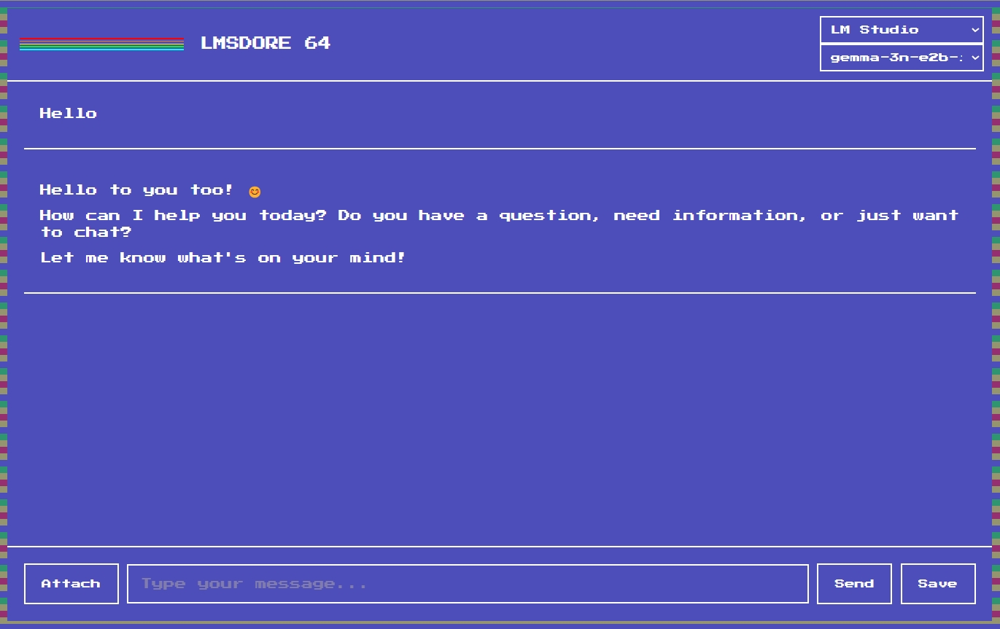

# LMSDORE 64 Chat App

A simple chat application integrated with LM Studio.

## Prerequisites
- Install and run the LM Studio server (`http://127.0.0.1:1234`).
- Ensure CORS is enabled in the LM Studio server configuration.

## Usage
1. Start the LM Studio server with CORS enabled.
2. Open `index.html` in a web browser.
3. Select a model from the dropdown and start chatting!

## Screenshot
